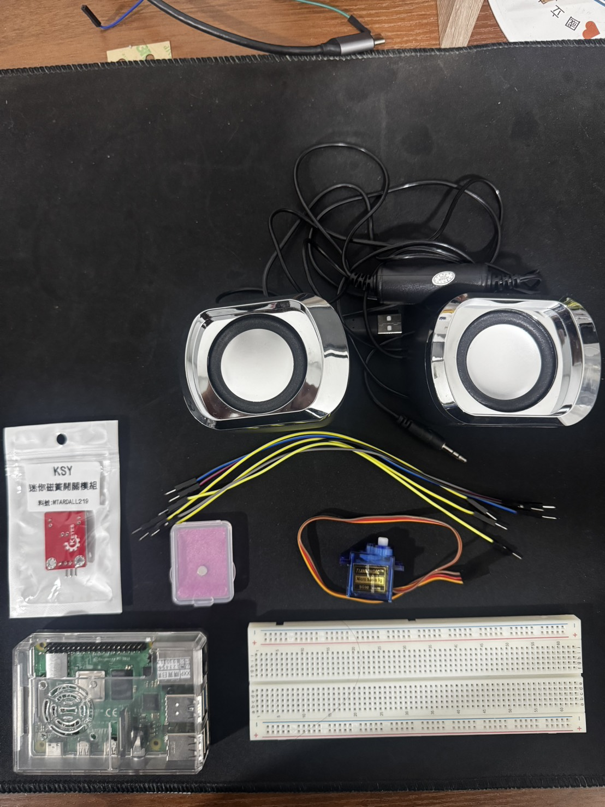
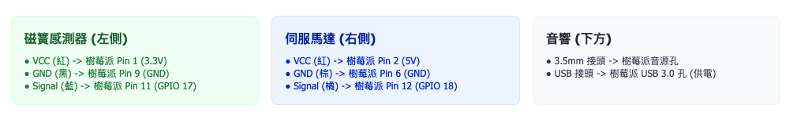
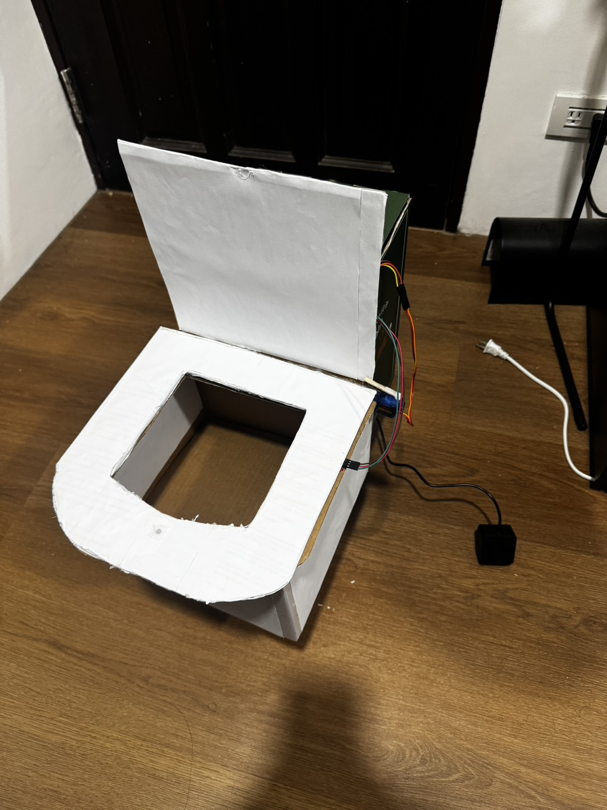

# SmartLid：智慧馬桶蓋提醒系統

> 一個以 Raspberry Pi 為核心的 DIY IoT 專案，透過磁簧開關偵測馬桶蓋狀態，在未落蓋時自動播放提醒音效、推動伺服馬達協助落蓋，並透過 LINE Bot 發送通知。

---

## 📋 目錄

1. [專案簡介](#-專案簡介)
2. [系統架構與原理](#-系統架構與原理)
3. [硬體需求](#-硬體需求)
4. [電路連接](#-電路連接)
5. [軟體安裝](#-軟體安裝)
6. [程式碼結構](#-程式碼結構)
7. [環境設定](#-環境設定)
8. [執行程式](#-執行程式)
9. [使用說明](#-使用說明)
10. [故障排除](#-故障排除)
11. [參考資源](#-參考資源)

---

## 🎯 專案簡介

### 問題背景
在租屋環境或一般家庭中，常因忘記放下馬桶蓋而造成衛生問題。傳統的智慧馬桶價格昂貴且不易攜帶，對租屋族群並不友善。

### 解決方案
SmartLid 提供一個**低成本、可攜帶、易安裝**的智慧落蓋提醒系統，利用 IoT 技術改善日常衛生習慣。

### 核心功能
- ✅ **即時偵測**：透過磁簧開關偵測馬桶蓋開合狀態
- ⏰ **智慧計時**：蓋子開啟超過設定時間（預設 60 秒）自動觸發提醒
- 🔊 **本地提醒**：播放音效提醒使用者
- 🤖 **自動落蓋**：伺服馬達輔助推動蓋子下降
- 📱 **遠端通知**：多次未落蓋時透過 LINE Message 推播通知
- 📊 **數據記錄**：記錄每日提醒次數（可擴充至資料庫）

---

## 🏗 系統架構與原理

### 工作流程

```
┌─────────────────────────────────────────────────────────────┐
│                    SmartLid 系統流程圖                          │
└─────────────────────────────────────────────────────────────┘

    [使用者掀開馬桶蓋]
            │
            ▼
    [磁簧開關偵測到 HIGH]
            │
            ▼
    [啟動 60 秒倒數計時]
            │
            ├─── 60秒內放下蓋子 ───► [取消計時器] ──► [結束]
            │
            └─── 60秒後仍未放下 ──┐
                                 │
                                 ▼
                    ┌─────────────────────┐
                    │  當日第 1 次未落蓋？   │
                    └─────────────────────┘
                             │
                ┌────────────┴────────────┐
                │                         │
               YES                       NO
                │                         │
                ▼                         ▼
        ┌──────────────┐        ┌──────────────────┐
        │  【階段1】    │        │   【階段2】       │
        │  播放提醒音效 │        │  播放警告音效     │
        │  +            │        │  +                │
        │  馬達推動落蓋 │        │  馬達推動落蓋     │
        │              │        │  +                │
        │              │        │  LINE Bot 通知    │
        └──────────────┘        └──────────────────┘
                │                         │
                └────────────┬────────────┘
                             │
                             ▼
                    [記錄提醒事件]
                             │
                             ▼
                         [結束]
```

### 階段說明

| 階段 | 觸發條件 | 動作 |
|------|---------|------|
| **階段1** | 當日第 1 次未落蓋 | 播放 `alert1.mp3` + 伺服馬達推動落蓋 |
| **階段2** | 當日第 2+ 次未落蓋 | 播放 `alert2.mp3` + 伺服馬達推動落蓋 + LINE Bot 通知 |

### 技術原理

#### 1. 磁簧開關工作原理
磁簧開關（Reed Switch）是一種由磁場控制的機械式開關：
- **磁鐵靠近**：開關閉合 → GPIO 讀取為 **LOW (0)**
- **磁鐵遠離**：開關斷開 → GPIO 讀取為 **HIGH (1)**

在本專案中：
- 磁鐵固定於**馬桶蓋**上
- 磁簧開關固定於**馬桶座**上
- 當蓋子**放下**時，磁鐵靠近開關 → **LOW**
- 當蓋子**抬起**時，磁鐵遠離開關 → **HIGH**

#### 2. 伺服馬達 PWM 控制
SG90 伺服馬達透過 PWM（脈衝寬度調變）訊號控制角度：
- **PWM 頻率**：50 Hz
- **佔空比範圍**：2.5% ~ 12.5%
  - 2.5%（0度） → 7.5%（90度） → 12.5%（180度）
- 本專案使用兩個角度：
  - `DUTY_REST = 3.3%`：靜止位置
  - `DUTY_PUSH = 8.1%`：推動位置

---

## 🔧 硬體需求

### 必要元件

| 元件 | 規格 | 用途 | 參考價格 |
|------|------|------|---------|
| **Raspberry Pi 4** | 2GB+ RAM | 主控制器 | NT$ 2,000 |
| **磁簧開關** | MTARDALL219 或類似型號 | 偵測蓋子開合 | NT$ 45 |
| **SG90 伺服馬達** | 微型伺服馬達 | 輔助落蓋 | NT$ 100 |
| **外接音響** | 3.5mm 音源孔 | 播放提醒音效 | NT$ 200 |
| **磁鐵** | 小型強力磁鐵 | 觸發磁簧開關 | NT$ 30 |
| **杜邦線** | 公對母、公對公 | 連接電路 | NT$ 50 |
| **麵包板** | 標準型（選用） | 測試電路 | NT$ 80 |
| **電阻** | 10kΩ（選用） | 下拉電阻 | NT$ 5 |

**總成本估算**：約 **NT$ 2,000** 元（不含 Raspberry Pi 則約 NT$ 1,000）

### 選用元件
- **GPIO 擴充板**：方便連接與除錯
- **電源供應器**：5V 3A（Raspberry Pi 官方電源）
- **SD 卡**：64GB+（安裝作業系統）

### 硬體元件實體照片

>   
> _專案使用的所有硬體元件：Raspberry Pi 4、磁簧開關模組、SG90 伺服馬達、磁鐵、杜邦線等_

---

## 📐 電路連接

### 接線圖

> **注意**：GPIO 編號使用 **BCM 模式**（非 BOARD 模式）

#### 1. 磁簧開關接線

```
Raspberry Pi          磁簧開關模組
┌─────────┐          ┌────────────┐
│ 3.3V    ├──────────┤  VCC       │
│         │          │            │
│ GPIO 17 ├──────────┤  信號輸出   │
│         │          │            │
│ GND     ├──────────┤  GND       │
└─────────┘          └────────────┘
```

#### 2. 伺服馬達接線（SG90）

```
Raspberry Pi          SG90 伺服馬達
┌─────────┐          ┌────────────┐
│ GPIO 18 ├──────────┤  訊號線(黃) │
│         │          │            │
│ 5V      ├──────────┤  電源線(紅) │
│         │          │            │
│ GND     ├──────────┤  地線(棕)   │
└─────────┘          └────────────┘
```

#### 3. 音響接線

```
Raspberry Pi          外接音響
┌─────────┐          ┌─────────┐
│ 3.5mm   ├──────────┤ AUX IN  │
│ Audio   │          │         │
└─────────┘          └─────────┘
```

### 完整電路原理圖

>   
> _完整的電路配線圖，顯示 Raspberry Pi、磁簧開關模組和伺服馬達的連接關係_

>   
> _實際硬體配置與接線示意圖_

#### 電路說明

本專案電路設計簡單，僅需連接三個主要元件：

1. **磁簧開關模組**（數位輸入）
   - 使用模組內建的上拉電阻，無需外接電阻
   - VCC 接 3.3V（避免電壓過高）
   - 信號輸出接 GPIO 17，讀取磁鐵靠近/遠離狀態

2. **SG90 伺服馬達**（PWM 輸出）
   - 需要 5V 電源（電流需求約 100-250mA）
   - PWM 訊號線接 GPIO 18，使用 50Hz 頻率控制角度
   - 共地（GND）連接確保訊號穩定

3. **音響**（類比音訊輸出）
   - 使用 Raspberry Pi 內建的 3.5mm 音訊孔
   - 無需額外電路，直接連接即可

> ⚠️ **注意事項**：
> - 磁簧開關使用 3.3V 而非 5V，避免損壞 Raspberry Pi GPIO
> - 伺服馬達必須接 5V 電源才能正常運作
> - 建議使用獨立電源供應器為 Raspberry Pi 供電（5V 3A）

### GPIO 針腳對照表

| 功能 | BCM 編號 | 實體針腳 | 線材顏色建議 |
|------|---------|---------|------------|
| 磁簧開關電源 | 3.3V | Pin 1 | 紅色 |
| 磁簧開關訊號 | GPIO 17 | Pin 11 | 黃色 |
| 磁簧開關 GND | GND | Pin 9 | 黑色 |
| 伺服馬達訊號 | GPIO 18 | Pin 12 | 黃色 |
| 伺服馬達電源 | 5V | Pin 2 | 紅色 |
| 伺服馬達 GND | GND | Pin 6 | 棕色 |

---

## 💻 軟體安裝

### 1. 安裝 Raspberry Pi OS

#### 步驟 1：下載 Raspberry Pi Imager
前往官網下載：https://www.raspberrypi.com/software/

#### 步驟 2：燒錄 OS 到 SD 卡
1. 選擇 **Raspberry Pi OS (64-bit)** Bookworm 版本
2. 選擇目標 SD 卡
3. 設定 Wi-Fi 與 SSH（建議啟用）
4. 開始燒錄

#### 步驟 3：啟動 Raspberry Pi
1. 將 SD 卡插入 Raspberry Pi
2. 接上電源、螢幕、鍵盤
3. 完成初始設定

### 2. 更新系統套件

```bash
sudo apt update && sudo apt upgrade -y
```

### 3. 安裝 Python 依賴

```bash
# 安裝 Python 3 與 pip
sudo apt install python3 python3-pip python3-venv -y

# 安裝系統級套件
sudo apt install python3-gpiozero python3-rpi.gpio -y

# 安裝音效相關套件
sudo apt install python3-pygame mpg123 -y
```

### 4. 下載專案程式碼

```bash
# 方法1：從 GitHub 下載
git clone https://github.com/your-username/SmartToilet.git
cd SmartToilet

# 方法2：手動建立專案目錄
mkdir -p ~/SmartToilet
cd ~/SmartToilet
```

### 5. 建立虛擬環境

```bash
python3 -m venv venv
source venv/bin/activate
```

### 6. 安裝 Python 套件

```bash
pip install -r requirements.txt
```

`requirements.txt` 內容：
```txt
gpiozero>=2.0
RPi.GPIO>=0.7.1
pygame>=2.5.0
requests>=2.31.0
python-dotenv>=1.0.0
```

---

## 📁 程式碼結構

```
SmartToilet/
├── README.md                    # 專案說明文件
├── QUICKSTART.md                # 快速入門指南
├── requirements.txt             # Python 依賴套件
├── .env                         # 環境變數設定（需手動建立）
├── .gitignore                   # Git 忽略清單
│
├── src/                         # 原始碼目錄
│   ├── config.py                # 配置管理（讀取 .env）
│   ├── main.py                  # 主程式入口
│   │
│   ├── controllers/             # 控制器模組
│   │   ├── audio_controller.py    # 音效播放控制
│   │   └── servo_controller.py    # 伺服馬達控制
│   │
│   ├── sensors/                 # 感測器模組
│   │   └── reed_switch.py         # 磁簧開關感測
│   │
│   ├── services/                # 服務模組
│   │   └── line_messaging.py      # LINE Bot 通知
│   │
│   └── utils/                   # 工具函式（擴充用）
│
├── data/                        # 資料目錄
│   ├── sounds/                  # 音效檔案
│   │   ├── alert1.mp3           # 階段1提醒音效
│   │   └── alert2.mp3           # 階段2警告音效
│   │
│   └── picture/                 # 圖片目錄
│       ├── all_components.jpg   # 所有硬體元件合照
│       ├── circuit_diagram.png  # 電路接線圖
│       └── hardware_setup.jpg   # 硬體安裝照片
│
├── config/                      # 設定檔（選用）
│
├── logs/                        # 日誌目錄
│
└── docs/                        # 文件與圖片
    ├── LINE_MESSAGING_API_GUIDE.md
    └── SmartLid_IoT_Project_Specification.json
```

### 模組說明

| 模組 | 檔案 | 功能 |
|------|------|------|
| **配置管理** | `config.py` | 從 `.env` 載入環境變數 |
| **主程式** | `main.py` | 系統流程控制與事件處理 |
| **音效控制** | `audio_controller.py` | 使用 Pygame 播放音效 |
| **馬達控制** | `servo_controller.py` | 使用 PWM 控制伺服馬達 |
| **磁簧感測** | `reed_switch.py` | 使用 gpiozero 讀取 GPIO |
| **LINE 通知** | `line_messaging.py` | 呼叫 LINE Messaging API |

### 核心程式碼說明

完整的原始碼位於 `src/` 目錄中，以下是主要模組的關鍵實作：

#### 主程式 (main.py)

主程式負責協調所有模組，處理 GPIO 事件和計時邏輯：

```python
"""
SmartLid 主程式 - 核心控制邏輯
使用模組化架構，分離硬體控制與業務邏輯
"""
import sys
import threading
from datetime import date
from signal import pause, signal, SIGINT

from config import Config
from controllers.audio_controller import AudioController
from controllers.servo_controller import ServoController
from sensors.reed_switch import ReedSwitch
from services.line_messaging import LineMessagingService

class SmartLidController:
    def __init__(self):
        self.countdown_timer = None
        self.is_countdown_active = False
        self.daily_alert_count = 0
        self.last_reset_date = date.today()
        self._init_hardware()
    
    def trigger_alert_and_push(self):
        """計時器到期，觸發提醒動作"""
        if not self.is_countdown_active:
            return
        
        self.is_countdown_active = False
        
        if self.reed_switch.is_lid_open():
            self._check_and_reset_daily_count()
            self.daily_alert_count += 1
            
            if self.daily_alert_count >= Config.DAILY_ALERT_THRESHOLD:
                # 階段2: 強烈警告 + LINE 通知
                self.audio.play_alert2()
                self.servo.push_lid()
                self.line_service.send_alert(self.daily_alert_count)
            else:
                # 階段1: 溫和提醒
                self.audio.play_alert1()
                self.servo.push_lid()
```

> 💡 **設計說明**：採用物件導向設計，將硬體控制封裝在各自的控制器類別中，提高程式碼可維護性。

#### 磁簧開關模組 (sensors/reed_switch.py)

使用 gpiozero 函式庫簡化 GPIO 操作：

```python
"""磁簧開關感測模組"""
from gpiozero import DigitalInputDevice

class ReedSwitch:
    def __init__(self, pin: int):
        self.device = DigitalInputDevice(pin)
    
    def is_lid_open(self) -> bool:
        """檢查馬桶蓋是否開啟 (HIGH=1=開啟)"""
        return self.device.value == 1
    
    def when_lid_opened(self, callback):
        """設定蓋子開啟時的回調函數"""
        self.device.when_activated = callback
    
    def when_lid_closed(self, callback):
        """設定蓋子關閉時的回調函數"""
        self.device.when_deactivated = callback
```

#### 伺服馬達控制 (controllers/servo_controller.py)

使用 RPi.GPIO 的 PWM 功能控制 SG90 馬達角度：

```python
"""伺服馬達控制模組"""
import RPi.GPIO as GPIO
import time

class ServoController:
    def __init__(self, pin: int, duty_rest: float, duty_push: float):
        GPIO.setmode(GPIO.BCM)
        GPIO.setup(pin, GPIO.OUT)
        self.pwm = GPIO.PWM(pin, 50)  # 50 Hz
        self.duty_rest = duty_rest
        self.duty_push = duty_push
        self.pwm.start(duty_rest)
        time.sleep(0.5)
    
    def push_lid(self):
        """執行推動落蓋動作"""
        # 轉到推動角度
        self.pwm.ChangeDutyCycle(self.duty_push)
        time.sleep(0.5)
        # 停留2秒
        time.sleep(2.0)
        # 回到靜止角度
        self.pwm.ChangeDutyCycle(self.duty_rest)
        time.sleep(0.5)
```

#### LINE 通知服務 (services/line_messaging.py)

使用 requests 函式庫呼叫 LINE Messaging API：

```python
"""LINE Messaging API 服務"""
import requests
from datetime import datetime

class LineMessagingService:
    def __init__(self, channel_access_token: str, user_id: str):
        self.token = channel_access_token
        self.user_id = user_id
        self.api_url = "https://api.line.me/v2/bot/message/push"
    
    def send_alert(self, alert_count: int) -> bool:
        """發送馬桶蓋提醒通知"""
        message = f"🚨 SmartLid 警告 (本日第 {alert_count} 次)\n\n馬桶蓋長時間未放下！"
        
        headers = {
            "Authorization": f"Bearer {self.token}",
            "Content-Type": "application/json"
        }
        
        payload = {
            "to": self.user_id,
            "messages": [{"type": "text", "text": message}]
        }
        
        response = requests.post(self.api_url, headers=headers, json=payload)
        return response.status_code == 200
```

> 📌 **完整原始碼**：所有程式碼均可在專案的 `src/` 目錄中找到，包含詳細註解與錯誤處理。

---

## ⚙️ 環境設定

### 1. 建立 `.env` 檔案

在專案根目錄建立 `.env` 檔案：

```bash
nano .env
```

### 2. 填入設定參數

```env
# SmartLid 環境變數設定檔

# 應用配置
APP_NAME=SmartLid
APP_ENV=production
DEBUG=False

# LINE Messaging API 配置
LINE_CHANNEL_ACCESS_TOKEN=你的_LINE_CHANNEL_ACCESS_TOKEN
LINE_USER_ID=你的_LINE_USER_ID

# GPIO 配置
REED_SWITCH_PIN=17
SERVO_PIN=18

# 計時配置（秒）
LID_OPEN_TIMEOUT=60
DAILY_ALERT_THRESHOLD=2

# 音效檔案路徑
ALERT1_SOUND=data/sounds/alert1.mp3
ALERT2_SOUND=data/sounds/alert2.mp3

# 伺服馬達 PWM 配置
SERVO_DUTY_REST=3.3
SERVO_DUTY_PUSH=8.1
SERVO_MOVE_TIME=0.5
SERVO_STABILIZE_TIME=0.1
SERVO_PUSH_HOLD_TIME=2.0
```

### 3. 取得 LINE Bot Token

#### 步驟 1：建立 LINE Messaging API Channel
1. 前往 [LINE Developers Console](https://developers.line.biz/)
2. 建立新的 Provider
3. 在 Provider 下建立 **Messaging API Channel**

#### 步驟 2：取得 Channel Access Token
1. 進入 Channel 設定頁面
2. 前往 **Messaging API** 頁籤
3. 點擊 **Issue** 按鈕取得 **Channel Access Token**
4. 複製 Token 並貼到 `.env` 的 `LINE_CHANNEL_ACCESS_TOKEN`

#### 步驟 3：取得 User ID
1. 加 LINE Bot 為好友（掃描 QR Code）
2. 使用以下程式取得 User ID：

```bash
python3 src/services/line_messaging.py
```

或手動透過 Webhook 取得（詳見 `docs/LINE_MESSAGING_API_GUIDE.md`）

### 4. 準備音效檔案

將兩個 MP3 音效檔案放入 `data/sounds/` 目錄：
- `alert1.mp3`：階段1提醒音效（溫和提醒）
- `alert2.mp3`：階段2警告音效（嚴重警告）

建議使用自行錄製或開源音效（請注意版權）。

---

## 🚀 執行程式

### 方法1：直接執行

```bash
cd ~/SmartToilet/src
sudo python3 main.py
```

> **注意**：必須使用 `sudo` 才能存取 GPIO

### 方法2：使用虛擬環境

```bash
source venv/bin/activate
sudo -E python3 src/main.py
```


---

## 📖 使用說明

### 正常運作流程

1. **啟動程式**：執行 `sudo python3 main.py`
2. **偵測蓋子狀態**：
   - 蓋子放下 → 顯示 `[偵測] 訊號 LOW (0): 馬桶蓋放下！`
   - 蓋子抬起 → 顯示 `[偵測] 訊號 HIGH (1): 馬桶蓋抬起！`
3. **開始計時**：蓋子抬起後啟動 60 秒倒數
4. **提醒動作**：
   - 若 60 秒內放下蓋子 → 取消計時器
   - 若 60 秒後仍未放下 → 觸發提醒（階段1或階段2）

### 終端機輸出範例

```
=========================================
🚽 SmartLid 核心控制程式  啟動
   延遲通知時間: 60 秒
   Stage 2 門檻: 當日 2 次
   馬達 PWM: 3.3% -> 8.1%
   推動停留時間: 2.0 秒
=========================================

[啟動檢測] 當前蓋子為「放下」狀態。

程式正在監聽 GPIO 事件 (按 Ctrl+C 結束)...

[偵測] 訊號 HIGH (1): 馬桶蓋抬起！
[狀態] 馬桶蓋開啟 (HIGH)。60 秒後將檢查並觸發動作...

⏰ 計時器到期！蓋子仍未放下。

🔔 [階段1 提醒] 當日第 1 次
🎵 [階段1] 播放提醒音效...
🔊 正在播放: data/sounds/alert1.mp3
✅ 音效播放完成: data/sounds/alert1.mp3
⚙️ 馬達動作: 開始輕推落蓋...
   → 推動至 8.1% 角度...
   → 維持角度 2.0 秒...
   → 回到靜止位置 3.3%...
✅ 馬達動作完成！
```

### 停止程式

按下 `Ctrl+C` 即可安全終止程式，系統會自動清理 GPIO 資源。

---

## 🔍 故障排除

### 常見問題

#### 1. **執行程式時出現 `Permission denied`**

**原因**：無 GPIO 存取權限

**解決方法**：
```bash
sudo python3 main.py
```

#### 2. **磁簧開關狀態不正確**

**症狀**：蓋子放下時讀取為 HIGH，抬起時為 LOW

**原因**：磁鐵極性或安裝位置錯誤

**解決方法**：
- 調整磁鐵與開關的距離（建議 < 1 cm）
- 嘗試翻轉磁鐵極性
- 檢查接線是否正確

#### 3. **伺服馬達不動作**

**可能原因**：
- 電源不足（需要 5V 供電）
- PWM 佔空比設定錯誤
- 訊號線接錯

**解決方法**：
- 確認伺服馬達電源線接在 5V 針腳
- 調整 `.env` 中的 `SERVO_DUTY_PUSH` 參數
- 使用萬用表測試 GPIO 18 輸出

#### 4. **音效無法播放**

**症狀**：程式執行但沒有聲音

**解決方法**：
```bash
# 測試音效輸出
speaker-test -t wav -c 2

# 確認音效裝置
aplay -l

# 手動播放音效檔案
mpg123 data/sounds/alert1.mp3
```

#### 5. **LINE 通知發送失敗**

**錯誤訊息**：`❌ LINE 通知發送失敗: HTTP 401`

**原因**：Token 無效或過期

**解決方法**：
1. 重新發行 Channel Access Token
2. 確認 `.env` 中的 Token 正確無誤
3. 檢查 User ID 是否正確

---

## 📚 參考資源

### 教學與文件

1. **Raspberry Pi GPIO 教學**
   - [Raspberry Pi Python scripting the GPIO (Instructables)](https://www.instructables.com/Raspberry-Pi-Python-scripting-the-GPIO/)
   - [gpiozero 官方文件](https://gpiozero.readthedocs.io/)

2. **IoT 專案範例**
   - [Cloud-IoT-Core-Kit-Examples (ARM-software)](https://github.com/ARM-software/Cloud-IoT-Core-Kit-Examples)
   - [Raspberry Pi Projects](https://projects.raspberrypi.org/)

3. **LINE Messaging API**
   - [LINE Messaging API 官方文件](https://developers.line.biz/en/docs/messaging-api/overview/)
   - [LINE Bot SDK Python](https://github.com/line/line-bot-sdk-python)

4. **Python 套件文件**
   - [pygame 官方文件](https://www.pygame.org/docs/)
   - [RPi.GPIO 文件](https://sourceforge.net/p/raspberry-gpio-python/wiki/Home/)
   - [requests 文件](https://requests.readthedocs.io/)

### 硬體資料表

- [MTARDALL219 磁簧開關規格](https://www.ltc.com.tw/products/mtardall118)
- [SG90 伺服馬達規格](https://www.towerpro.com.tw/product/sg90/)
- [Raspberry Pi 4 針腳圖](https://pinout.xyz/)

### 社群資源

- [Raspberry Pi Forums](https://forums.raspberrypi.com/)
- [Arduino & Raspberry Pi Stack Exchange](https://arduino.stackexchange.com/)

---

## 📷 實體照片與展示

### 硬體安裝實拍

>   
> _磁簧開關與磁鐵安裝於馬桶座與蓋子上的實際情況_

### 系統運作展示

> [](https://youtu.be/huhw_iSwexY)  
> _📹 點擊觀看完整影片：偵測蓋子開啟 → 播放音效 → 馬達推動落蓋 → LINE 通知_

**YouTube 影片連結**：https://youtu.be/huhw_iSwexY

---

## 🛠 未來擴充方向

- [ ] **Web Dashboard**：使用 Flask 建立網頁監控介面
- [ ] **SQLite 資料庫**：記錄完整的使用歷史
- [ ] **MQTT 整合**：連接至智慧家庭系統（Home Assistant）
- [ ] **語音提醒**：加入 TTS（文字轉語音）功能
- [ ] **PIR 感測器**：偵測是否有人離開（未來版本）
- [ ] **更多通知方式**：支援 Telegram、Discord、Email

---

## ⭐ Star History

如果這個專案對你有幫助，歡迎給個 Star ⭐️

---

**Happy Making! 🚀**
